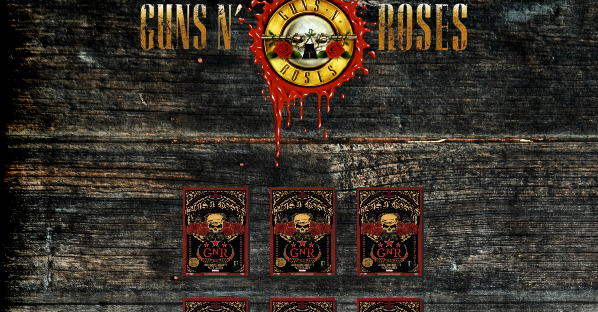

# Guns N' Roses  JS Memory Game
This is a simple  JavaScript memory game. With a Guns N' Roses theme
It's a school assignment. The code could be a bit messy since it's my first bigger assignment in JS.

There is two bugs that I know of now.
* When a card is flipped and you click it again the variable that flipped the card will be NULL and the application breaks.
* When finished a game there is a div displayed with play again option it will appear in the wrong place

## Capability
Works in Chrome v.54 and Firefox v.49. I have not tested it on earlier versions, so might not work there.

### Screenshot

